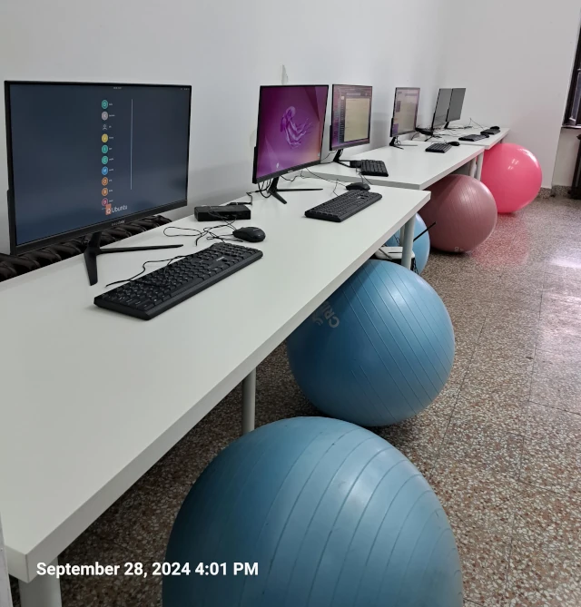

# Linux command line - terminal komande

Svaki kompjuter se mnogo lakse upravlja preko tekstualnih komadi u terminalu (onaj crni prozorcic).

Terminal mozete pokrenuti tako sto stisnete Win dugme i pretrazujete Terminal ili pomocu keyboard shortcut *Ctrl+T*.

Kada se kaze shell, terminal, command line, prompt, console... su sve sinonimu za terminal tj program u kojem kucate komande.

Ok, postoje razliciti terminalni prozori (GNOME Terminal, Konsole, windows terminal) i razliciti shellovi (npr Bourne shell /bin/sh ne podrzava alias, history, tab completion, background tasks)

Linux je CaseSensitive (morate obratiti paznju da li su mala ili velika slova, uglavnom treba koristiti mala slova). Kada postoji razmak (space) u nazivu fajla, onda se mora escapovati `ime\ fajla.txt` ili staviti u navodnike `"ime fajla.txt"` (uglavnom treba koristiti donju crtu umesto space)

Bas dobar tutorijal je na [Ubuntu Command Line for beginners](https://ubuntu.com/tutorials/command-line-for-beginners#1-overview)

<iframe width="560" height="315" src="https://www.youtube.com/embed/YcJtGXmy1-A?si=9c1sLo1Z-mK1U-Xx" title="YouTube video player" frameborder="0" allow="accelerometer; autoplay; clipboard-write; encrypted-media; gyroscope; picture-in-picture; web-share" referrerpolicy="strict-origin-when-cross-origin" allowfullscreen></iframe>

Navigation

* `pwd` (print working directory)
* `cd` (change directory), `cd ..` (idi u parent), `cd ~/Downloads` (idi u home/Downloads)
* `mkdir folderName` (napravi folder), `mkdir -p folder1/folder2/folder3` (napravi parent foldere ako ne postoje)

File manipulation

* `cp fileName destinationFileOrFolder` (copy), `cp ~/Downloads/a.txt .` (kopiraj a.txt iz Downloads u trenutni folder), `mv fileName destinationFileOrFolder` (premesta fajl, tj posle kopiranja ce obrisati fileName)
* `rm fileName` (remove), `rm -r folderName` (obrisace folder i sve fajlove unutar njega)
* `ls` (list), `ls a*` (izlistaj sve fajlove i foldere koji pocinju sa a), `ls -a` show all files, including hidden (start with dot eg .bashrc)

Text inspection

* `echo Neka recenica` komanda za ispisivanje recenice, `echo -n without new line at the end` without new line
* `cat fileName` concatenate files
* `wc fileName` (word count)
* `sort fileName` (sort)
* `uniq` remove repeated lines (only consecutive lines, not any duplicated lines)

Strings and special characters

* `cat file\ name` sprecava specijalno znacenje narednog znaka
* `ls 'file name'` inside quote it is a single string
* `ls "fine name"` inside double quote it is single string but ! and $VAR se uvazavaju
* `rm `find / -name core -print`` unutar ` se zamenjuje rezultatom

Shell redirection

* `ls | less` pipe komanda prosledjuje output stdout predhodne komande u input stdin za novu komandu
* `ls > output.txt` znak vece preusmerava output u fajl (ukoliko fajl postoji, sadrzaj ce biti obrisan), `ls >> output.txt ` dodaje output na postojeci sadrzaj fajla, `failedCommand >& output.txt` preusmerava stdout i stderr u fajl
* `cat < fileName` preusmerava stdin da se cita iz fajla fileName
* `echo << HERE_DOC ` stanardni ulaz se cita iz istog fajla do reci HERE_DOC (end-of-input)

Multiple commands

* `ls;pwd` multiple commands, `(ls;pwd) > output` to group command
* `ls \ grep a`multiline commands in separate lines use backslash to continue command in new line

Alias

* `alias pp=pwd` create alias pp for pwd, `alias -a` show all aliases, `unalias pp` remove pp alias

Scripts

* `source fileName` (also `. fileName`) 

Control jobs

* `ctrl+c` prekida tekuci posao
* `kill processId`
* `logout` exit when it is login shell `exit [status]` exit in any shell
* `du > usage &` run commad in background
* `ctrl+z` temporary stop the process, `fg` foreground, `jobs` list all jobs

History

* `history` see previous commands
* `!!` run previous command
* `!ls` run last command that start with `ls`

Users and groups

* `su username` (switch user), `sudo ls` run ls as root user and return to normal user

Important files

`.bashrc` se pokrece u svakom shellu (non login shellu, ali svakako login shell ovo poziva tako da mozemo smatrati da se svakako izvrsava)

Keyboard shortcut

* `Up/Down or Ctrl+p/Ctrl+n` previous or next command from history
* `Ctrl+d logout or exit`

Install packages

* `sudo apt install packageName`

Env

* `echo $PATH` list of folders where shell look for a command

